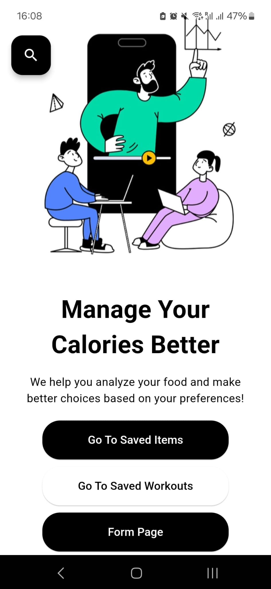
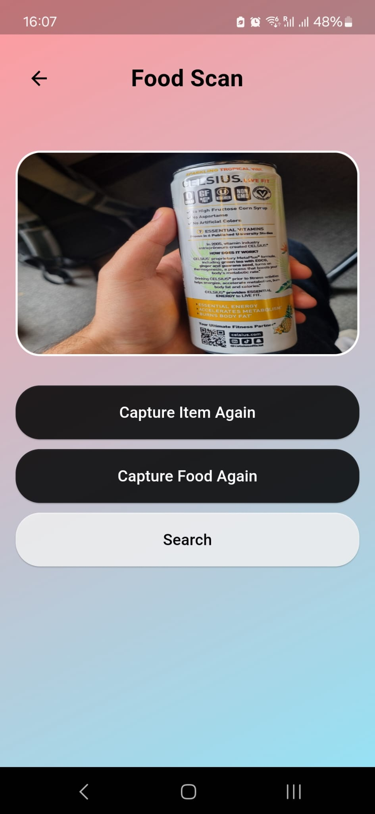
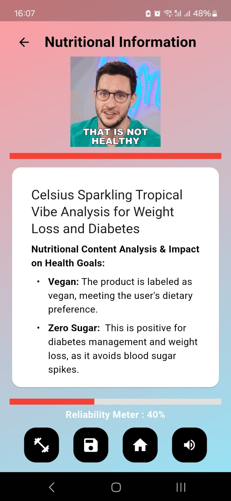
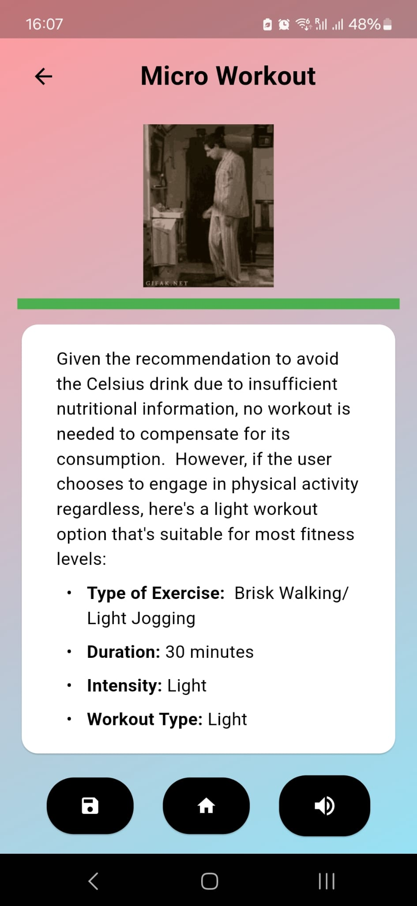
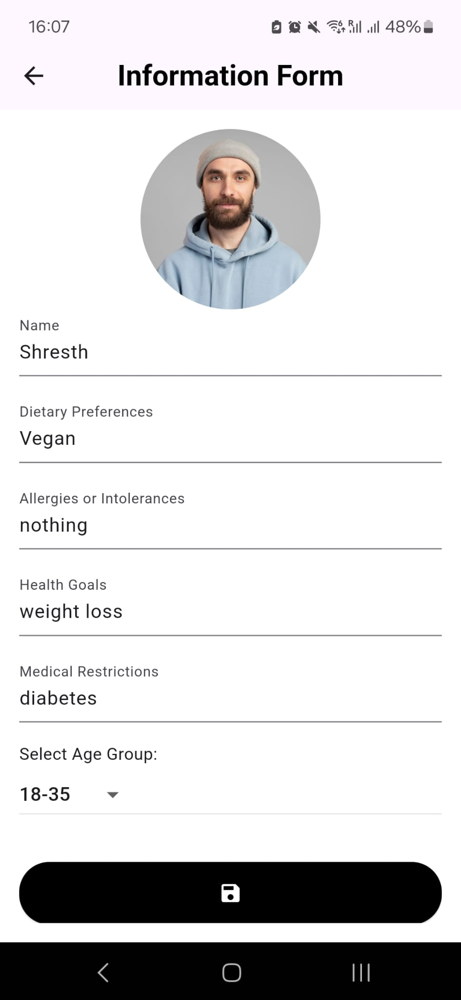
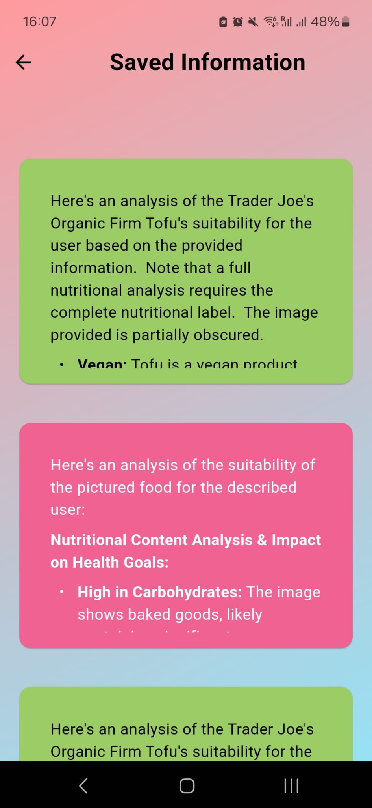

# Snapple – AI-Powered Food Analysis Application  

Snapple is an AI-driven mobile application that helps users make informed dietary choices. Using **Google Gemini LLM**, the app analyzes food items in real-time based on user-specific health data. The application ensures **personalized nutrition recommendations** by considering stored health preferences, helping users determine whether a particular food item aligns with their dietary goals.  

## Features  
✅ **Scan & Analyze** – Capture images of food items or scan product labels for real-time nutritional analysis.  
✅ **LLM-Powered Insights** – Leverages **Gemini AI** for ingredient breakdown and health impact assessment.  
✅ **Personalized Recommendations** – Uses **SharedPreferences** to store user-specific health data (e.g., allergies, dietary restrictions) locally for tailored advice.  
✅ **Offline Compatibility** – Ensures minimal dependency on cloud processing by storing essential preferences locally.  
✅ **Minimalistic & Fast** – Designed with **Flutter**, offering a lightweight, user-friendly experience.  

## Tech Stack  
- **Flutter** – Frontend for cross-platform mobile support  
- **Google Gemini API** – AI-powered food analysis and recommendations  
- **SharedPreferences** – Local storage for user-specific health data  
- **Camera & Image Processing** – Enables food item scanning  

## How It Works  
1. **Capture or Upload an Image** – Take a picture of your food or scan a product label.  
2. **AI Analysis** – The app processes the image and extracts relevant food information.  
3. **Personalized Recommendation** – Based on stored health preferences, the AI suggests whether you should consume the item.  
4. **Learn More** – View insights on nutritional content, healthier alternatives, and impact on your health.  

  
| Home Screen | Scan Feature | Food Insights |
|------------|-------------|--------------|
|  |  |  |

| Micro Workouts | Health Form | Saved Items |
|-------------|----------------|---------|
|  |  |  |

